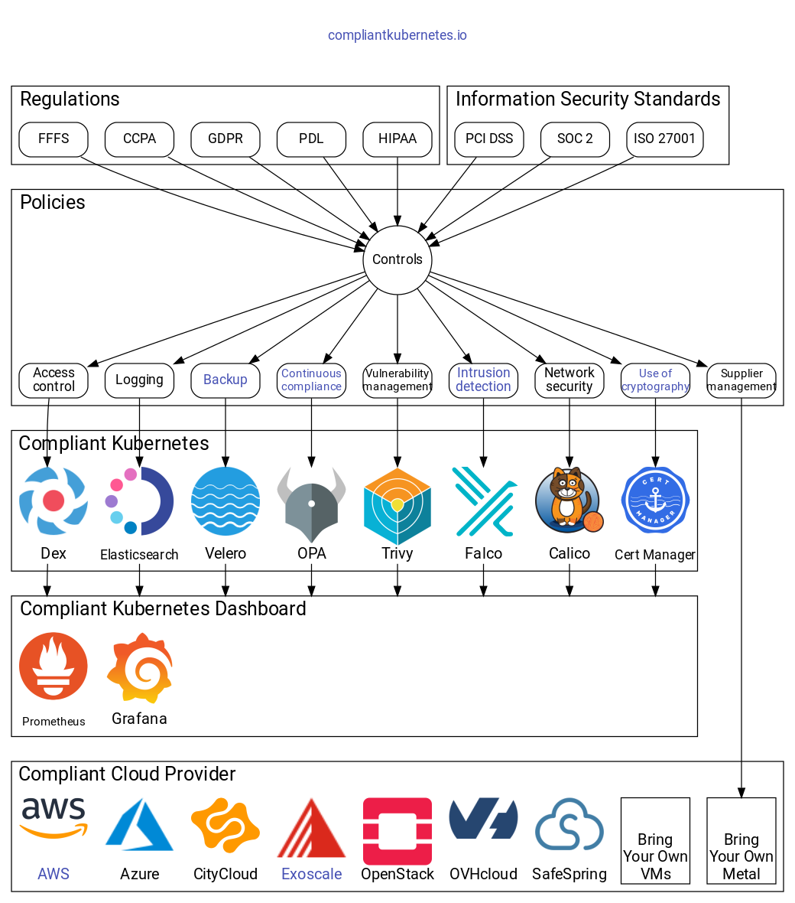

# Compliance Basics

Compliance will vary widely depending on:

* Jurisdiction (e.g., US vs. EU);
* Industry regulation (e.g., MedTech vs. FinTech);
* Company policies (e.g., log retention based on cost-risk analysis).

The following is meant to offer an overview of compliance focusing on information security, and how Compliant Kubernetes reduces compliance burden.

## Compliance: The Societal Perspective

Organizations in certain sectors, such as BioTech, FinTech, MedTech, and those processing personal data, need **public trust** to operate. Such companies are allowed to handle sensitive data, create and destroy money, etc., in exchange for being compliant with certain regulations — in devtalk put, sticking to some rules set by regulators. For example:

* Any bank operating in Sweden is regulated by the Swedish Financial Authority (Finansinspectionen) and has to comply with FFFS.
* Any organization dealing with personal data is scrutinized by the Swedish Data Protection Authority (Datainspectionen) and needs to comply with GDPR.
* Any organization handling patient data needs to comply with HIPAA in the US or Patientdatalagen (PDL) in Sweden.

Such regulation is not only aspirational, but is actually checked as often as yearly by an external auditor. If an organization is found to be non-compliant it may pay heavy fines or even lose is license to operate.

## Compliance: The Engineering Perspective

Translating legalese into code involves several steps. First a Compliance Officer will identify what regulations apply to the company. Based on those regulations, they will draft **policies** to clarify how the company should operate — i.e., run its daily business — in the most efficient manner while complying with regulations. To ensure the policies do not have gaps, are non-overlapping and consistent, they will generally follow an **information security standard**, such as ISO/IEC 27001, SOC-2 or PCI-DSS. Such information security standards list a set of **controls**, i.e., "points" in the organization where a check needs to be put in place.

The resulting policies need to be interpreted and implemented by each department. **Compliant Kubernetes addresses the needs of the infrastructure team.**

In essence, Compliant Kubernetes are carefully configured Kubernetes clusters together with other open-source components. It reduces compliance burden by allowing an organization to focus on making their processes and application compliant, knowing that the underlying platform is compliant.
