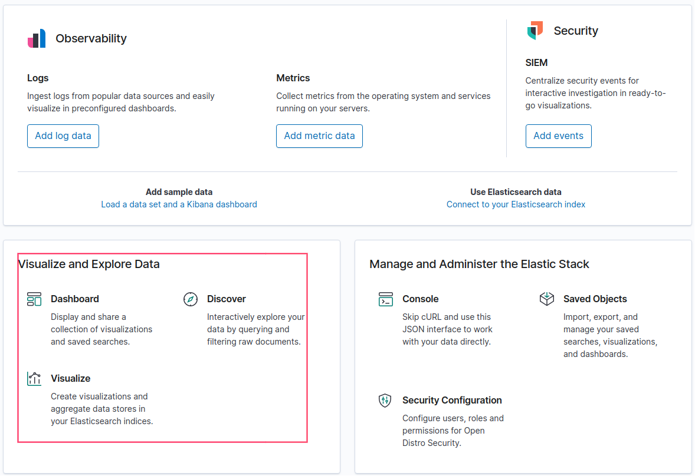
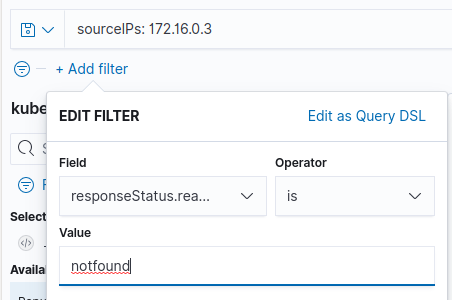
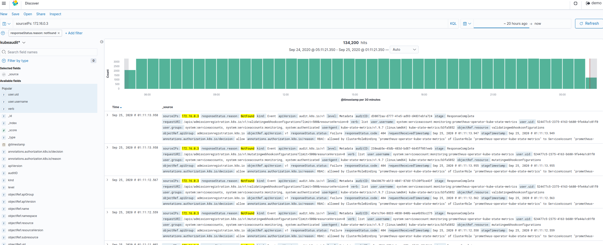
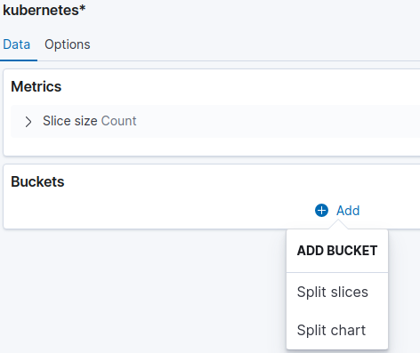
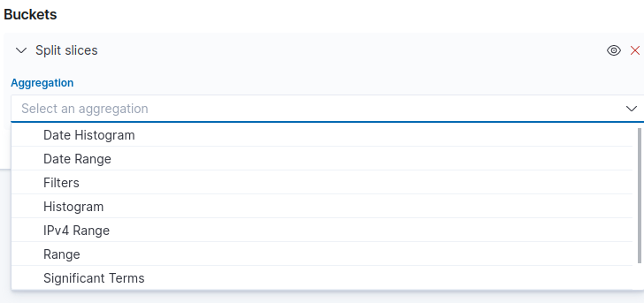
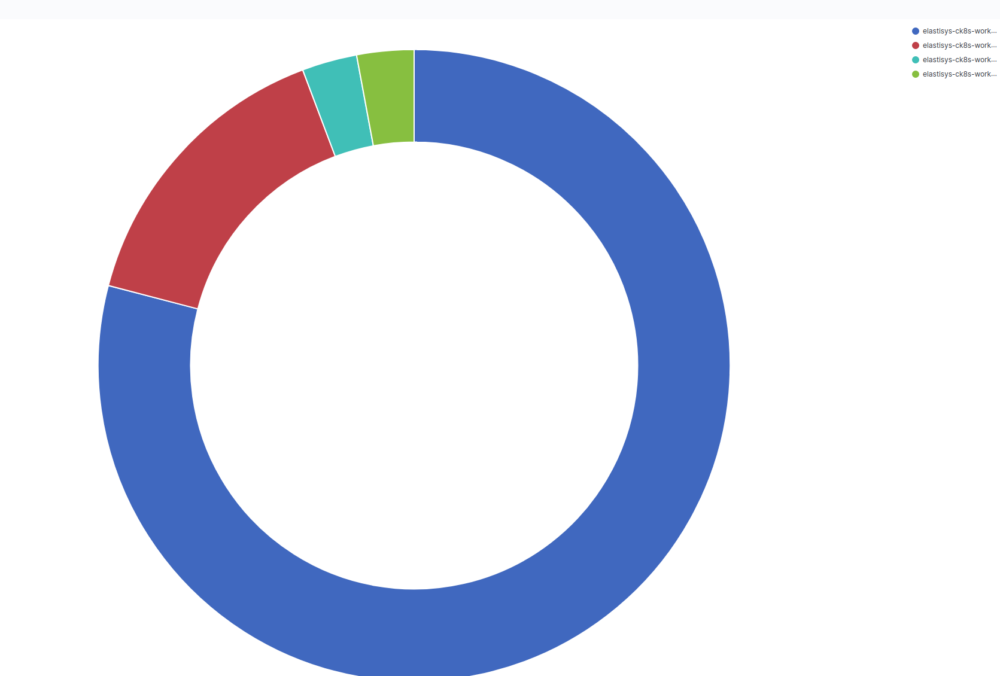

# Logging

Compliant Kubernetes (CK8S) provides the mechanism to manage your cluster as well as  the lifecycle of thousands of containerized applications deployed in  the cluster. The resources managed by CK8S are expected to be highly distributed with dynamic behaviors. An instance of CK8S cluster  environment involves several components with  nodes that host hundreds of containers that are constantly being spun up and destroyed based on workloads.

When dealing with a large pool of containerized applications and workloads in CK8S, it is imperative to be proactive with continuous monitoring and debugging information in order to observe what is going on the cluster. These information can be seen at the container, node, or cluster level.  Logging as one of the [three pillars of observability](https://www.oreilly.com/library/view/distributed-systems-observability/9781492033431/ch04.html#:~:text=Logs%2C%20metrics%2C%20and%20traces%20are,ability%20to%20build%20better%20systems.) is a crucial element to manage and monitor services and infrastructure. It allows you to track debugging information at different levels of granularity.

## Compliance needs

The requirements to comply with ISO 27001 are stated in ISO [27001:2013](https://www.isms.online/iso-27001/). The annexes that mostly concerns logging are:

- [Annex 12](https://www.isms.online/iso-27001/annex-a-12-operations-security/), article A.12.4.1 "Event Logging" and A.12.4.3 "Administrator and Operator Logs".
- [Annex 16](https://www.isms.online/iso-27001/annex-a-16-information-security-incident-management/) which deals with incident management.

In Compliant Kubernetes, Elasticsearch is separate from the production workload, hence it complies with A.12.4.2 "Protection of Log Information". The cloud provider should ensure that the clock of Kubernetes nodes is synchronized, hence complying with A.12.4.4 "Clock Synchronisation".

## Open Distro for Elasticsearch

Raw logs in CK8S are normalized, filtered, and processed by [fluentd](https://www.fluentd.org/) and shipped to Elasticsearch for storage and analysis. CK8S uses fully open source version of Elasticsearch called  [Open Distro for Elasticsearch](https://logz.io/blog/open-distro-for-elasticsearch/).

Open Distro for Elasticsearch provides a powerful, easy-to-use event monitoring and alerting system, enabling you to monitor, search, visualize your data among other things. Kibana is used as visualization and analysis interface  for Elasticsearch for all your logs.

## Visualization using Kibana
Kibana is used as a data visualization and exploration tool for log time-series  and aggregate analytics. It offers powerful and easy-to-use features such as histograms, line graphs, pie charts, heat maps, and built-in geospatial support.

When you log into Kibana, you will encounter a page similar to the one shown below.

Since we are concerned with searching logs and their visualization, we will focus on **Visualize and Explore Data** as   indicated by the red rectangle in the figure above. If you are interested to know more about the rest please visit the[ official Kibana documentation](https://opendistro.github.io/for-elasticsearch-docs/docs/kibana/).

Before we dive into Kibana, let us discuss the type of logs ingested into Elasticsearch. Logs in CK8S cluster are filtered and indexed by fluentd into three categories:

  1. **kubeaudit logs** related to [Kubebernetes audits](https://kubernetes.io/docs/tasks/debug-application-cluster/audit/) to provide security-relevant chronological set of records documenting the sequence of activities that have affected system by individual users, administrators or other components of the system.
This is mostly related to the ISO 27001 requirement A.12.4.3 "Administrator and Operator Logs".

  1. **Kubernetes logs** that provide insight into CK8S resources such as nodes, Pods, containers, deployments and replica sets. This allows you to observe the interactions between those resources and see the effects that one action has on another. Generally, logs in the CK8S ecosystem can be divided into the cluster level (logs outputted by components such as the kubelet, the API server, the scheduler) and the application level (logs generated by pods and containers).
This is mostly related to the ISO 27001 requirement A.12.4.3 "Administrator and Operator Logs".

  1. **Others** logs other than the above two are indexed and shipped to Elasticsearch as *others*. Such logs are basically your application level logs.
This is mostly related to the ISO 27001 requirement A.12.4.1 "Event Logging".

Let us dive into Kibana then.

### Data Visualization and Exploration in Kibana

As you can see in the figure above, data visualzation and expoloration in Kibana has three components: **Discover**, **Visualize** and **Dashboard**.  The following section discribes each components using examples.

#### Discover

The **discover** component in  Kibana is used for exploring, searching and filtering logs.

Click **Discover** in the main Kibana page to access the features provided by it. The figure below shows partial view of the page that you will get under **Discover**.

  

As yopu can see in the above figure, the **kubeaudit** index logs are loaded by default. If you want to explore logs from either of the other two log indices please select the right index under the dropdown menu marked *log index category*.

To appreciate Kibana's searching and filtering capability, let us get data for the following question:

 **Get all logs that were collected for the past 20 hours in host 172.16.0.3 where the responseStatus reason is notfound**

 We can use different ways to find the answer for the question. Below is one possible solution.

  1.  Write **sourceIPs: 172.16.0.3**  in the **search textbox**.

  1. Click **Add Filter** and select **responseStatus.reason** and **is** under **field** and **Operator** dropdown menus respectively. Finally, enter
**notfound** under **Value** input box and click **Save**. The following figure shows the details.

      

  1. To enter the 20 hours, click part that is labelled **Time** in the **Discover** figure above, then enter **20** under the input box and select **hours** in the dropdown menu. Make sure that you are under **Relative** tab. Finally, click **update**. The following figure shows how to set the hours. Note that the data will be automatically updated as time passes to reflect the past 20 hours data from the current time.

      

Once you are done, you will see a result similar to the following figure.

  

#### Visualize

The **Visualize** component in Kibana is to create different visualizations. Let us create a couple of visualizations.

To create visualizations:

  1. Go to the main Kibana page and click **Visuale**.
  2. Click **Create visualization** link located on the top right side of the page.
  3. Select a visualization type, we will use **Pie** here.
  4. Choose the index name or saved query name, if any,  under **NNew Pie / Choose a source**. We will use the **Kubernetes** index here.

By default a pie chart with the total number of logs will be provided by kibana. Let us divide the pie chart based on the number of logs contributed by each **namespace**. To do that perform the following steps:

  1. Under **Buckets** click **add** then **Split Slices**. See the figure below.

      

  1. Under **aggregation** select **Significant Terms** terms. see the figure below.

      

  1. Select **Kubernetes.namespace_name.keyword** under **field**. See the figure below.

      

The final result will look like the following figure.

Please save the pie chart as we will use it later.

Let us create a similar pie chart using **host** instead of **namespace**. The chart will look like the following figure.

#### Dashboard

The **Dashboard** component in Kibana is used for organizing related visualizations together.

Let us bring the  two visualizations that we created above together in a single dashboard.

To do that:

1. Go to the main Kibana page and click **Dashboard**.
2. Click **Create Dashboard** link located on the top right side of the page.
3. Click **Add existing** link located on the left side.
4. Select the name of the two charts/visualizations that you created above.

The figure below shows the dashboard generated from the above steps showing the two pie charts in a single page.

# Further Reading

* [Open Distro for Elasticsearch](https://opendistro.github.io/for-elasticsearch/)
* [Kibana](https://opendistro.github.io/for-elasticsearch-docs/docs/kibana/)
* [Open Distro for Elasticsearch – How Different Is It?](https://logz.io/blog/open-distro-for-elasticsearch/)
* [Fluentd](https://www.fluentd.org/)
